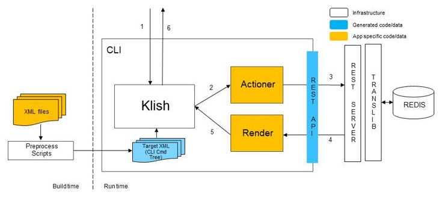

## CLI in SONiC Ecosystem

SONiC uses a multi-tier CLI approach.

Depending on what you are trying to do, you are interacting with different software engines under the hood:

- Klish
- Click
- Vtysh
- Bash

Let us explain each with more details.

### Klish

Klish is a vendor-neutral, schema-driven framework designed to implement CLIs. Because it is independent of any specific networking platform, its XML-based definitions allow for highly portable and reusable command structures across different systems.

When you run the `sonic-cli` command from the SONiC host, you are not executing a local host binary. Instead, the system opens an interactive session into the `sonic-mgmt-framework` container and initializes the Klish engine. Klish uses XML files (stored within the container) to define the command tree, hierarchy, and available options.

Klish does not modify the system configuration directly. Instead, it follows a structured, API-driven execution flow:

- **The Actioner**: Once a command is entered, Klish identifies the associated Actioner defined in the XML.

- **API Call**: The Actioner acts as a client, sending a REST API request to the Management Server (also running inside the container).

- **Database Integration**: The Management Server validates the request against YANG models. If successful, it writes the configuration into the Redis ConfigDB, which serves as the system's central source of truth.

- **Output Rendering**: The server returns a response (typically in JSON format). Klish then passes this data to a Renderer script, which utilizes Jinja2 templates to format the raw data into the clean, human-readable tables or text displayed on your terminal.

For a detailed architectural diagram of this process, refer to the [SONiC Management Framework Documentation](https://github.com/sonic-net/SONiC/blob/master/doc/mgmt/Management%20Framework.md#3221-cli)

### Click

This is the default shell when you log into a standard SONiC switch via SSH. It is a set of Python scripts built using the [Click](https://click.palletsprojects.com/en/stable/) library. It consists of two primary command utilities: `config` (for writes) and `show` (for reads).

- **Config Commands**: When you execute a command like `sudo config interface ip add...`, the Python script validates the input locally and then performs a direct write to the Redis ConfigDB. There is no intermediate API server or "dry run" phase; the database is updated immediately.

- **Show Commands**: When you run `show interface status`, the Click script queries the Redis StateDB or ConfigDB, pulls the raw data, and prints it to the console.

Because these scripts interact directly with the system's Redis databases and low-level networking files, they require root privileges. Unlike Klish, which handles permissions internally, Click requires you to prefix almost every configuration command with sudo.

Unlike Klish, Click has no "Global Configuration Mode". Each command is a standalone execution. You cannot enter a sub-mode to run multiple commands; you must type the full command string for every change.

### FRR and Vtysh

In the SONiC architecture, FRR ([FRRouting](https://docs.frrouting.org/en/latest/)) serves as the routing engine running within the `bgp` Docker container. It acts as the control plane, managing protocols such as BGP, OSPF, and IS-IS. When FRR learns a new route, it updates the Linux kernel, which SONiC subsequently synchronizes to the hardware ASIC to enable line-rate forwarding.

FRR maintains its own internal configuration state, which is separate from SONiC's central database (Redis ConfigDB). [vtysh](https://docs.frrouting.org/projects/dev-guide/en/latest/vtysh.html) is the native command-line shell for FRR (similar to a Cisco CLI). While powerful, using vtysh directly creates a "split brain" scenario where the running configuration in FRR no longer matches the persistent configuration in Redis.

If you configure a route directly in `vtysh` but do not update Redis, the configuration will be lost upon a system reboot or config reload. To manage this, SONiC offers two distinct modes of operation: Unified Mode and Split Mode.

#### Unified Mode

In **Unified Mode**, SONiC treats the Redis ConfigDB as the single source of truth. A synchronization daemon, known as `frrcfgd` (or `bgpcfgd` in older versions), continuously monitors the Redis ConfigDB. When you make a change using SONiC management tools (such as the SONiC CLI/Klish or Click), the daemon detects the update and automatically pushes the corresponding configuration into FRR. This ensures that your routing configuration is persistent, centralized, and synchronized across the entire system without requiring direct interaction with the FRR shell.

The following diagram clearly illustrates the workflow of Unified Mode in SONiC, distinguishing between boot-time and run-time operations. During system startup, `sonic-cfggen` reads the persistent configuration from `config_db.json` and generates the initial configuration files for the individual FRR daemons (bottom path). Once the system is running, the `frrcfgd` daemon takes over responsibility for synchronization; it continuously monitors the Redis CONFIG_DB for any changes initiated by the Management Framework. When a routing change is detected, `frrcfgd` translates it and pushes the update directly to the running FRR container (middle path). While the vtysh remains accessible for viewing state or testing unsupported parameters, these manual changes are not persisted back to the SONiC database.

#### Split Mode

In **Split Mode**, the synchronization link is severed. The operator explicitly separates the management of device infrastructure (ports, interfaces) from the management of routing protocols. The `frrcfgd` daemon stops overwriting the FRR configuration. The operator must configure routing protocols directly via `vtysh` and save them to the `frr.conf` file, just as they would on a traditional Linux router.

Split mode allows access to advanced FRR features (e.g., complex route maps, specific OSPF tweaks) that may not yet be supported by the SONiC object model or CLI. It also provides a familiar interface for network engineers used to standard industry CLIs (like Cisco IOS or Arista EOS) without needing to learn SONiC-specific database structures. It offers direct control over the routing engine for troubleshooting and complex topologies where automated templating might be too restrictive.

### Bash

Because SONiC is built on a standard Debian Linux distribution, the Bash shell gives you direct access to the underlying OS. This is particularly powerful for system-level troubleshooting that goes beyond networking, such as monitoring CPU and memory utilization with `htop`, checking disk space with `df -h`, or reviewing kernel messages via `dmesg`. Since most SONiC services (like SWSS, LLDP, and BGP) run as independent Docker containers, the Bash shell serves as the cockpit from which you can manage these containers using standard docker commands, such as `docker ps` to check service health or `docker exec` to drop into a specific daemon's environment.

Beyond simple monitoring, the Bash shell is the primary environment for automation and advanced recovery. Network administrators often use it to run custom Python scripts or shell scripts that interact with the SONiC Object Library. It is also the place where you interact with the Redis database directly via `redis-cli` to inspect the state of the switch in real-time. While the Click or KLISH interfaces are preferred for standard configuration to ensure database consistency, Bash remains indispensable for tasks like manual log rotation, managing SSH keys, installing Debian packages (`apt-get`), or troubleshooting hardware-specific issues through the `/sys/class` file system.
