# Smart Command Suggestions

When a user mistypes a CLI command, most systems print a generic error and stop. A suggestion engine does more: it compares the invalid input to the commands that are actually valid, and offers the closest matches.

This document explains the algorithms behind that behavior. Techniques are numbered 1–16 and written in dependency order: if technique A uses an idea from technique B, B is explained first. Each section covers the idea, a worked example, and the trade-offs. Working Python implementations live in [`techniques/`](../techniques/).

| Group | Techniques | What you will learn |
|-------|------------|---------------------|
| [Prefix Matching](#prefix-matching) | 1–2 | Match the start of a word (no typo tolerance) |
| [Edit Distance](#edit-distance) | 3–7 | Count character edits, then refine the scoring |
| [Alternative Similarity Measures](#alternative-similarity-measures) | 8–9 | Score closeness without counting edits |
| [Search Scope](#search-scope) | 10–11 | Choose *which* commands to compare against |
| [Special Cases](#special-cases) | 12–14 | Hyphens, user-supplied values, and token order |
| [AI Intent Matching](#technique-15-ai-intent-matching) | 15 | Recover meaning when the typed text does not resemble a local command |
| [Combined Approach](#technique-16-combined-approach) | 16 | How the techniques run together as one pipeline |

---

## How CLI Commands Are Organized

In this project, commands are defined in [Klish](README_KLISH.md) XML and form a **command tree**. At any point in a command, only a small set of next words is legal.

```text
root
├── channel-group
│   └── <ID>
├── configure
│   └── terminal
├── debug
│   ├── bgp
│   ├── daemon
│   └── telemetry
├── history
├── interface
│   ├── Ethernet
│   │   └── <ID>
│   └── port-channel
│       └── <ID>
├── neighbor
│   └── <IP>
│       └── remote-as
│           └── <ASN>
├── ping
│   └── <IP>
├── router
│   └── bgp
│       └── <ASN>
├── show
│   ├── bgp
│   │   ├── neighbors
│   │   │   └── <IP>
│   │   │       ├── advertised-routes
│   │   │       └── received-routes
│   │   └── summary
│   ├── greeting
│   ├── interface
│   ├── interfaces
│   │   ├── counters
│   │   └── summary
│   ├── ip
│   │   ├── interface
│   │   └── route
│   ├── running-config
│   ├── terminal
│   └── version
└── traceroute
    └── <IP>
```

After the user types `show`, the valid next words are `bgp`, `greeting`, `interface`, `interfaces`, `ip`, `running-config`, `terminal`, and `version`. If they type `show interfce`, the engine knows `interfce` is not in that set. The question is which valid word they most likely meant. Angle-bracket names (`<IP>`, `<ASN>`, `<ID>`) are argument slots, not keywords.

### Tokens, keywords, and arguments

A **token** is one word, split on spaces. `show ip interface` is three tokens.

Tokens fall into two kinds:

| Kind         | What it is                         | Examples                         | Should the engine correct it? |
|--------------|------------------------------------|----------------------------------|-------------------------------|
| **Keyword**  | A fixed word from the command tree | `show`, `interface`, `neighbor`  | Yes                           |
| **Argument** | A value the user supplies          | `10.0.0.1`, `65001`, `Ethernet0` | No — it is data, not a command name |

A suggestion engine should rewrite misspelled keywords and leave arguments unchanged. That distinction is used throughout, and is applied in detail in [Technique 13](#technique-13-variable-argument-preservation).

### What the engine actually compares

Suggestion is a **string similarity** problem:

1. Identify the first token that is not a valid keyword (the failing token).
2. Collect the legal keywords at that position (the **candidates**).
3. Score how close the failing token is to each candidate.
4. Keep scores within a **threshold** (the worst score still treated as a plausible typo) and present the best matches.

Techniques 1–9 are different ways to do step 3. Techniques 10–11 are different ways to do steps 1–2. Techniques 12–14 handle cases that generic scoring misses. Technique 15 covers intent matching when local scoring is not enough. Technique 16 puts the pieces together.

The right scoring method depends on the size of the command set, the mistakes users actually make, and how much time the CLI can spend.

---

## Prefix Matching

The fastest methods check whether what the user typed is the *beginning* of a valid keyword. They never invent a match from a typo, but any wrong character causes them to fail.

### Technique 1: Exact Prefix Matching

Check whether the input is an exact prefix of any candidate. If exactly one candidate matches, suggest it. If several share that prefix, list them all.

**How it works**

Input `inter`, candidates `[greeting, interface, ip, terminal, version]`:

1. Compare `inter` with the start of each candidate.
2. `interface` starts with `inter`.
3. No other candidate in this list does.
4. Suggest `interface`.

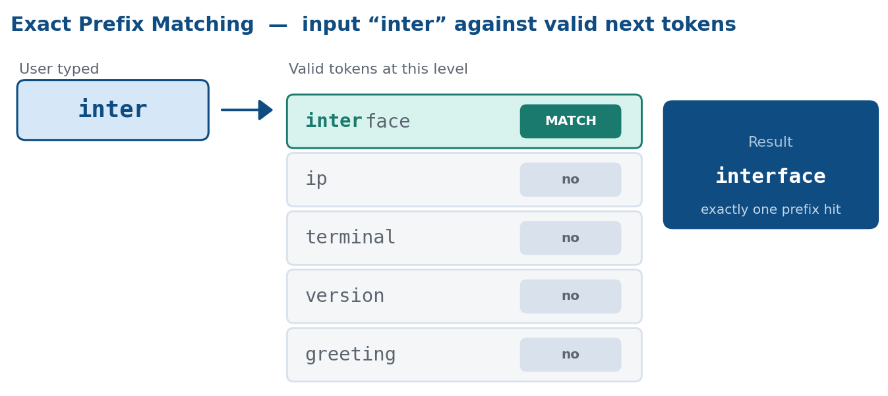

In the full tree, `interfaces` is also present, so the same prefix matches both `interface` and `interfaces`. If several candidates share the prefix, list them all.

**Example**

```text
NetLab# show gre
Closest match:
  show greeting
```

```text
NetLab# show inter
Closest match:
  show interface
  show interfaces
```

**Pros**

- One loop and a prefix check.
- If it matches, the user almost certainly meant that command.
- Fast: a linear scan of a short candidate list.

**Cons**

- Only works when every typed character is correct. `interfce` and `inteface` match nothing.
- No help for swapped letters (`shwo`), wrong letters (`intarface`), or extra letters.
- Useful as a first pass, not as the only method.

---

### Technique 2: Multi-token Prefix Abbreviation

Technique 1 matches one token. This technique does the same thing for every token in the line: the user types a shortened prefix of each keyword, and the engine expands each one in place.

This matches how experienced operators type. They are not making a mistake; they are abbreviating on purpose.

**How it works**

Input `sh bgp sum`:

1. Split into `[sh, bgp, sum]`.
2. Match each token as a prefix of the keyword at that level of the tree.
3. `sh` → `show`, `bgp` → `bgp`, `sum` → `summary`.
4. Result: `show bgp summary`.

Matching is positional. Token 1 is compared only with first-level keywords, token 2 only with children of the match from token 1, and so on.

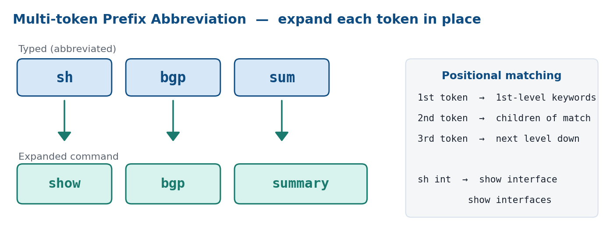

**Example**

```text
NetLab# sh ip int
Closest match:
  show ip interface
```

When a prefix is ambiguous:

```text
NetLab# sh int
Closest match:
  show interface
  show interfaces
```

`int` is a prefix of both `interface` and `interfaces`, so both expansions are offered. The engine does not invent extra tokens the user did not type (it will not expand `sh int` into `show interfaces summary`).

**Pros**

- Matches real operator habit: `conf t` → `configure terminal`, `sh ver` → `show version`.
- Works across the full command, not just one word.
- Every suggestion is a valid expansion of what was typed.

**Cons**

- Tokens must line up with the tree. `sh sum` (intending `show bgp summary`) fails because `sum` is compared with children of `show`, not with grandchildren.
- Very short prefixes match too many keywords (`sh i` matches `interface`, `interfaces`, and `ip`).
- A typo inside the abbreviation (`shw` for `show`) is not a prefix, so it misses. Fuzzy matching, next, is what handles that.

---

## Edit Distance

Prefix matching requires every typed character to be correct. **Edit distance** relaxes that: it counts how many single-character fixes turn the typo into a candidate. A distance of 0 is an exact match. A distance of 1 is one fix. Smaller is better.

Levenshtein introduces the idea with three kinds of edit. Each following technique changes what counts as an edit, or how expensive that edit is.

### Technique 3: Levenshtein Distance

The Levenshtein distance is the smallest number of these three operations needed to turn one string into another:

| Operation | Meaning | Example |
|-----------|---------|---------|
| **Insertion** | Add a missing letter | `sho` → `show` (add `w`) |
| **Deletion** | Remove an extra letter | `showw` → `show` (drop extra `w`) |
| **Substitution** | Replace a wrong letter | `shiw` → `show` (`i` → `o`) |

**How it works**

`interfce` → `interface` is one insertion (`a` after `interf`). Distance: **1**.

`shwo` → `show` is different. Levenshtein has no “swap two letters” operation, so it treats the swap as a deletion plus an insertion. Distance: **2**. [Technique 4](#technique-4-damerau-levenshtein-distance) adds that swap as a single edit.

Computers find the minimum by filling a table. Each cell answers: “How many edits turn this prefix of the typo into this prefix of the candidate?” The bottom-right cell is the answer for the full strings.

```text
        ""  i  n  t  e  r  f  a  c  e
    ""   0  1  2  3  4  5  6  7  8  9
    i    1  0  1  2  3  4  5  6  7  8
    n    2  1  0  1  2  3  4  5  6  7
    t    3  2  1  0  1  2  3  4  5  6
    e    4  3  2  1  0  1  2  3  4  5
    r    5  4  3  2  1  0  1  2  3  4
    f    6  5  4  3  2  1  0  1  2  3
    c    7  6  5  4  3  2  1  1  1  2
    e    8  7  6  5  4  3  2  2  2  1
```

The bottom-right value is `1`, matching the single missing `a`.

**Applying it to suggestions**

Given `show interfce` and the candidates at that position `[greeting, interface, ip, terminal, version]`:

| Candidate | Distance |
|-----------|----------|
| `interface` | 1 |
| `greeting` | 7 |
| `ip` | 7 |
| `terminal` | 7 |
| `version` | 7 |

Keep only distances within the threshold (for example, 3). Suggest `interface`.

**Pros**

- Covers the majority of real typos: missing, extra, or wrong letters.
- Available in most libraries; the same input always yields the same distance.

**Cons**

- Adjacent swapped letters cost 2, which overstates a single slip.
- Runtime grows with both string lengths: the algorithm builds one table per comparison, with a row for each character in one string and a column for each character in the other. Fine for dozens or hundreds of keywords; worth watching on very large lists.
- Every edit costs the same. Replacing `a` with nearby `e` is penalized the same as replacing `a` with `z`.

---

### Technique 4: Damerau-Levenshtein Distance

Adds a fourth operation to Levenshtein:

| Operation | Meaning | Example |
|-----------|---------|---------|
| **Transposition** | Swap two neighboring letters | `shwo` → `show` (`w` and `o` flip) |

Adjacent transpositions are among the most common typing mistakes. Counting them as one edit, not two, ranks those typos correctly.

**How it works**

The same table as Levenshtein, plus one extra option at each cell: if the last two letters are a swap of the candidate’s last two letters, treat that as a single transposition.

```text
shwo → show
  Levenshtein:           2  (delete w, insert w)
  Damerau-Levenshtein:   1  (transpose w and o)
```

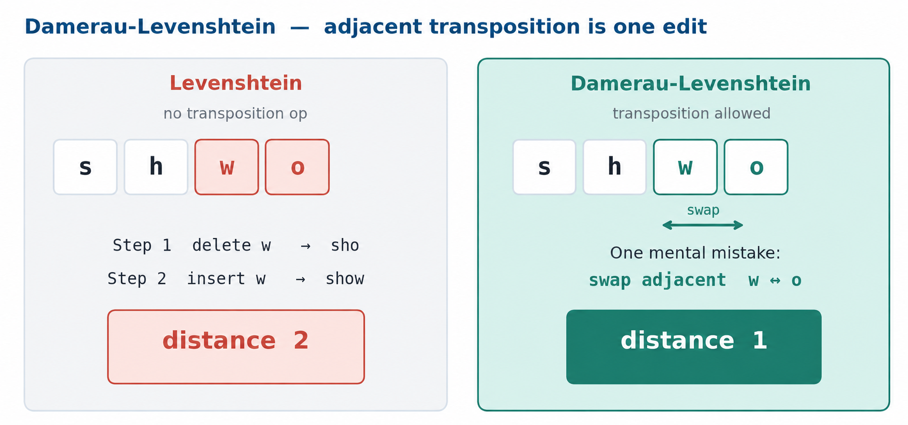

**Pros**

- Strictly better than Levenshtein for real typing errors, at almost the same cost.
- The usual default for spell-check and command correction.

**Cons**

- Slightly harder to implement correctly than Levenshtein.
- Still treats every remaining operation as equal. A swap, an insertion, and a substitution all cost 1, even though they are not equally likely. Technique 5 addresses that.

---

### Technique 5: Weighted Edit Costs

Standard Damerau-Levenshtein gives every edit a cost of 1. Weighted costs give each *kind* of edit a different cost, so more likely mistakes rank higher when two candidates would otherwise tie.

**How it works**

Use the Damerau-Levenshtein table, but plug in operation weights instead of `1`:

| Operation | Weight | Example | Why |
|-----------|--------|---------|-----|
| Transposition | 0 | `runnign` → `running` | Most common slip; letters are present and almost in order |
| Insertion | 1 | `runniing` → `running` | Extra keystroke; input is longer than the candidate |
| Substitution | 2 | `wunning` → `running` | Wrong letter in the right place; could be a different word |
| Deletion | 3 | `rning` → `running` | A letter is missing, so information is gone |

```text
runnign → running
  Standard DL:  1  (one transposition)
  Weighted:     0  (transposition weight is 0)

wunning → running
  Standard DL:  1  (one substitution)
  Weighted:     2  (substitution weight is 2)
```

Under standard Damerau-Levenshtein these tie. With weights, the transposition ranks first, which matches how people actually type.

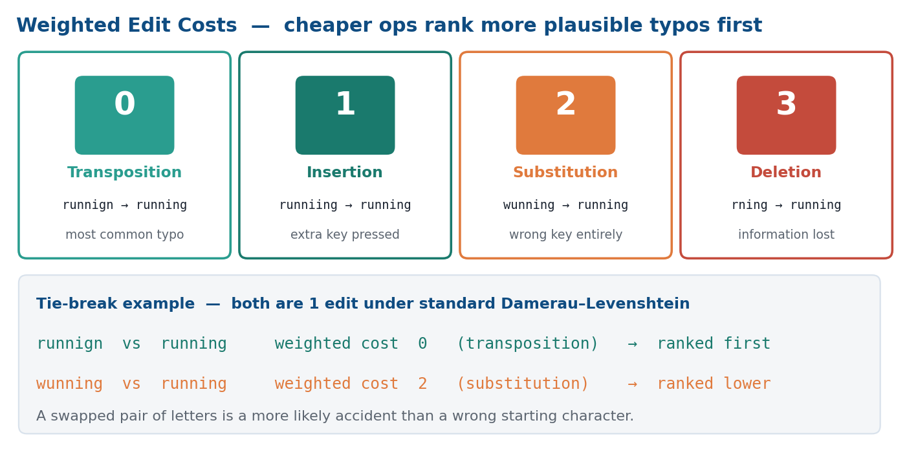

**Pros**

- Breaks ties in favor of the more plausible typo.
- Same table-filling algorithm; only the cell costs change.

**Cons**

- The numbers are a judgment call. They come from general typing studies and may need tuning for a given keyboard or user population.
- A transposition weight of 0 treats any adjacent swap as a perfect match on cost, which can over-promote a swap against another single edit.

---

### Technique 6: Keyboard-Aware Weighted Distance

Technique 5 varies cost by *operation type*. This technique varies cost by *which keys* were involved. A substitution between neighboring keys is more likely than a substitution between distant keys, so it should cost less.

**How it works**

On QWERTY, measure how far apart two keys sit and turn that into a substitution cost (adjacent keys around 0.33, distant keys capped at 1.0):

```text
cost('f', 'g') = 0.33   adjacent, same row
cost('f', 'd') = 0.33   adjacent, same row
cost('f', 'p') = 1.00   far apart
cost('f', 'f') = 0.00   same key
```

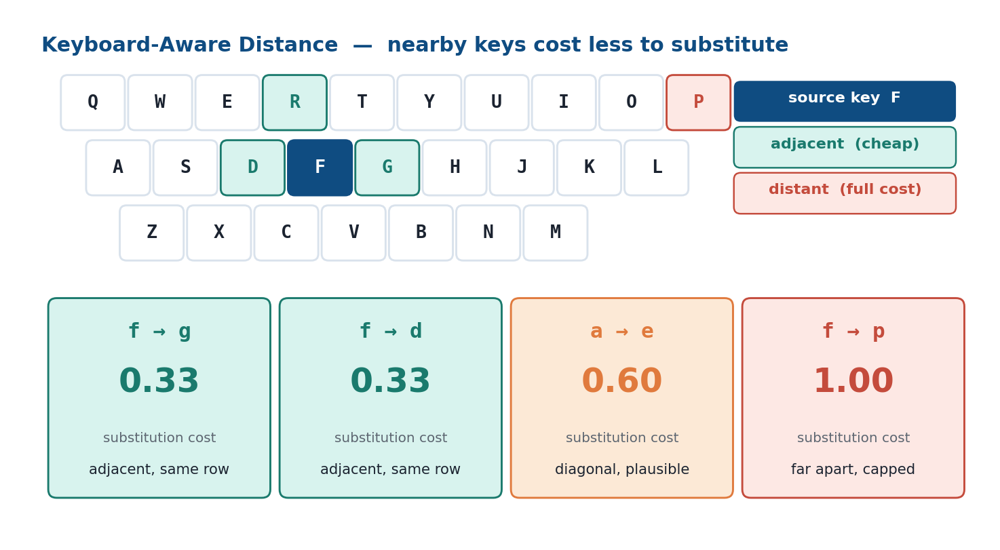

The demo implementation in [`techniques/06_keyboard_aware.py`](../techniques/06_keyboard_aware.py) builds on plain Levenshtein (Technique 3), so transpositions still cost two edits. The same idea could be added to Damerau-Levenshtein; this demo does not, which is why Technique 16 does not include keyboard-aware costs.

```text
intarface → interface   (a instead of e)
  Standard:        substitution cost 1
  Keyboard-aware:  a and e are fairly close; cost ≈ 0.60

interfacs → interface   (s instead of e)
  Standard:        substitution cost 1
  Keyboard-aware:  s and e are close; cost ≈ 0.37
```

The second typo ranks as the more likely adjacent-key miss.

**Pros**

- Models adjacent-key mistakes instead of treating every wrong letter as equal.
- Useful tie-breaker when several candidates share the same unweighted distance.

**Cons**

- Tied to one layout. QWERTY weights do not help AZERTY, Dvorak, or non-Latin keyboards.
- Needs a key-position table and a distance function.
- On a small command set, unit-cost Damerau-Levenshtein already ranks well, so the extra accuracy is often small.

---

### Technique 7: Threshold Scaling by Token Length

The previous techniques produce a distance. A **threshold** decides which distances are still worth showing. A single fixed cutoff (for example, “accept distance ≤ 3”) fails at both extremes:

- Short keywords become too loose: `bgp` at threshold 3 matches almost anything.
- Long keywords become too strict: `running-config` with two honest typos may be rejected.

Threshold scaling sets the cutoff from the candidate’s length.

**How it works**

| Candidate length | Max distance | Examples |
|------------------|--------------|----------|
| 1–4 characters   | 2            | `bgp`, `ip`, `show` |
| 5–8 characters   | 4            | `route`, `version` |
| 9+ characters    | 6            | `interface`, `running-config` |

Compute the distance as usual. If it is above that candidate’s cutoff, discard it, even if it is the best remaining score.

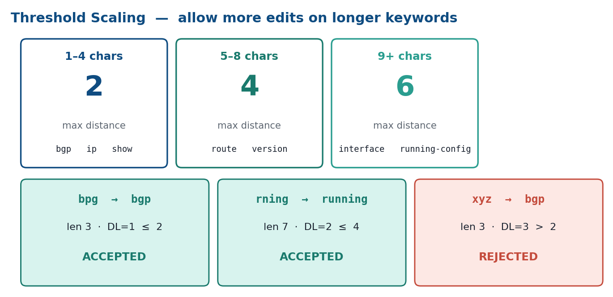

**Example**

| Input   | Candidate            | Distance                | Cutoff | Result |
|---------|----------------------|-------------------------|--------|--------|
| `bpg`   | `bgp` (length 3)     | 1 (transposition)       | 2      | Accept |
| `rning` | `running` (length 7) | 2 (two deletions)       | 4      | Accept |
| `xyz`   | `bgp` (length 3)     | 3 (three substitutions) | 2      | Reject |

**Pros**

- Stops garbage input from matching short keywords.
- Allows a few mistakes in long keywords, where they are more likely.
- One lookup after the distance is computed.

**Cons**

- The breakpoints (4, 8) and cutoffs (2, 4, 6) are heuristics. They need to be tuned on the real command set.
- The filter looks only at the total, not at which edits produced it. Four transpositions and four deletions are treated the same.

---

## Alternative Similarity Measures

Edit distance answers “how many fixes?” A **similarity score** answers “how alike are these strings?” Higher is better, and the value is usually normalized to a 0–1 range (0 means completely different, 1 means identical), so one threshold can apply to short and long words alike.

These two methods do not replace edit distance; they are different tools with different strengths.

### Technique 8: Jaro-Winkler Similarity

Jaro-Winkler returns a score from 0 (unrelated) to 1 (identical). It gives extra weight to a shared prefix, which fits CLI use: people often type the beginning correctly and stumble later.

**How it works**

Jaro looks at three things:

1. **Matching characters** — letters that appear in both strings within a limited window (about half the longer string).
2. **Lengths** — each string’s matches are divided by its length, so a long string needs more matches to score well.
3. **Transpositions** — matching letters that are out of order lower the score.

```text
jaro = average of:
  matches / length of string 1
  matches / length of string 2
  (matches − transpositions/2) / matches
```

Winkler then boosts the score when the first few characters (up to 4) already match, but only if the Jaro score is already at least 0.7. Without that minimum, two unrelated strings that happen to start with the same letter would get an undeserved boost:

```text
winkler = jaro + (prefix_length × scaling_factor × (1 − jaro))
```

For `interfce` vs `interface`, Jaro is already high (~0.96). The first six letters match, but the bonus only counts the first four (`inte`), which pushes Jaro-Winkler to ~0.98.

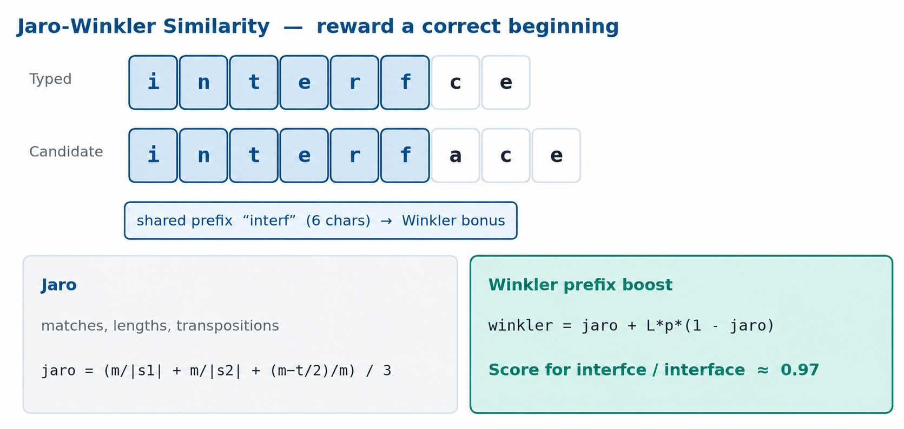

**Pros**

- Rewards a correct beginning, which is common in CLI typing.
- One 0–1 threshold works across different word lengths.
- Works well when the two strings have different lengths.

**Cons**

- The number is harder to explain than “two edits away.”
- Very short strings can score high even when they are unrelated.
- A mistake at the *start* of the word removes the prefix bonus, so those typos are ranked worse.

---

### Technique 9: N-gram Similarity

An **n-gram** is a short overlapping slice of a string. For N = 2 (bigrams), `cat` becomes `{ca, at}`. Similarity is how many slices two strings share.

**How it works**

Bigrams of `interface` and `interfce`:

```text
interface → { in, nt, te, er, rf, fa, ac, ce }   (8)
interfce  → { in, nt, te, er, rf, fc, ce }        (7)

shared    → { in, nt, te, er, rf, ce }            (6)

similarity = 2 × shared / (total1 + total2)
           = 2 × 6 / (8 + 7)
           = 0.80
```

A missing letter only breaks the two or three slices that touched it, instead of shifting the rest of the string.

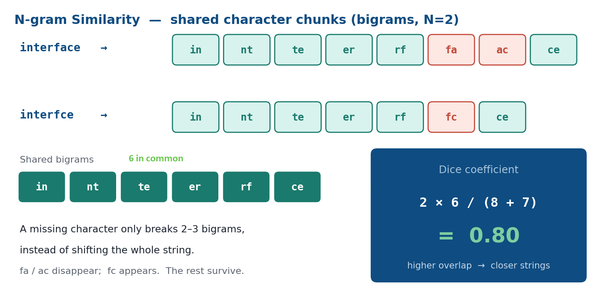

**Pros**

- Tolerant of a missing or extra letter in the middle of a word.
- Fast: build the slices in one pass, then intersect two sets.
- Candidate n-gram sets can be built once at startup.

**Cons**

- Order inside each slice is all you keep; two strings with the same letters in a different order can look more similar than they are.
- The choice of N matters (2 vs 3) and is not universal.
- Transpositions and substitutions are not modeled as explicitly as in edit distance.

---

## Search Scope

Techniques 1–9 assume a list of candidates already exists. This group answers *where that list comes from*. Comparing against every command in the system is slow and produces irrelevant hits. The command tree is the natural way to narrow — or, when that fails, to widen — the search.

### Technique 10: Context-Aware Tree Matching

Walk the tree token by token. At the first token that is not an exact keyword, compare it only with the keywords that are legal *at that position*.

This is not a similarity formula. It is a filter that wraps around whatever scoring method you choose from above.

**How it works**

For `show interfce`:

1. `show` matches the first level. Enter the `show` subtree.
2. Legal keywords here: `bgp`, `greeting`, `interface`, `interfaces`, `ip`, `running-config`, `terminal`, `version`.
3. Score `interfce` against only those keywords.
4. `interface` at distance 1 is the best match (`interfaces` is distance 2).

Without this scoping, a string that happens to look like a keyword from another branch (for example `configure`) could surface as a suggestion.

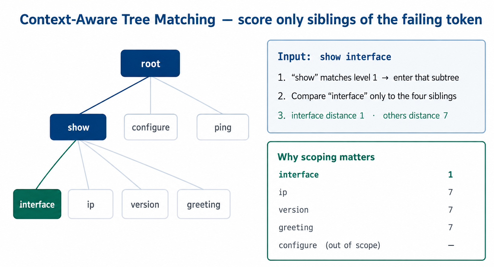

**How to combine with a scorer**

1. Walk the tree while tokens match exactly.
2. At the first failure, collect siblings at that level.
3. Score them with Damerau-Levenshtein, Jaro-Winkler, or another method from above.
4. Apply the length threshold, sort, and show the top results.

**Pros**

- Users never see a suggestion from an unrelated part of the CLI.
- The comparison set shrinks from hundreds of commands to a handful of siblings.
- Works with any scoring method.

**Cons**

- Needs the parsed command tree at runtime (from Klish XML, or an equivalent).
- Only the first failing token is considered. `shwo interfce` stops at `shwo`; `interfce` is never scored.
- If nothing at that level is close enough, the search stops. Technique 11 is the fallback.

---

### Technique 11: Flat-Corpus Scan

Technique 10 is precise, but it only looks at siblings of the first failure. If nothing there is close — or the user typed only a partial command — a good match may still exist elsewhere in the tree.

A **flat-corpus scan** treats every complete command as one string in a list and compares the whole input against that list.

**How it works**

1. Run the tree walk first. If it already has a strong match, skip this scan.
2. Otherwise, build the list of executable commands: `show interface`, `show ip interface`, `show version`, `configure terminal`, and so on.
3. Compare each user token with the corresponding token in each command (prefix match or edit distance).
4. Rank by how many tokens match and how closely they match.

**Example**

Input `debug` with nothing after it. The tree walk matches `debug` and then has no failing token to correct. The flat scan still finds complete commands that start with that keyword:

```text
NetLab# debug
Closest match:
  debug bgp
  debug daemon
  debug telemetry
```

Another case: abbreviations that line up with the template. `sh bgp sum` does not match `show` exactly, so the tree walk does not find a strong result. The flat scan compares token by token and accepts prefixes, so `sh`→`show`, `bgp`→`bgp`, `sum`→`summary`.

This copy does **not** skip a middle keyword. `sh sum` is compared positionally (`sum` vs `bgp` on `show bgp summary`), so it does not specially recover `summary`.

**Pros**

- Recovers commands the tree walk misses (abbreviations, a lone first keyword, typos that are weak at the first failure).
- Complements the tree walk: fast path first, whole-tree scan only when needed.

**Cons**

- Compares against the entire command set, so it is slower.
- Without tree scoping, unrelated commands that share a token can leak into the list.
- Skip this scan when the tree walk already produced a high-confidence result.

---

## Special Cases

Generic scoring plus tree scoping cover most typos. Three CLI-specific patterns need extra logic: hyphenated keywords, user-supplied values, and tokens typed in the wrong order.

### Technique 12: Hyphenated Keyword Handling

Many network commands use hyphenated keywords: `running-config`, `port-channel`, `snmp-server`. Users often type those parts as separate words (`running config`) or typo only one part (`rning config`). Scoring `rning` against the whole string `running-config` makes the distance look huge, so a generic matcher misses it.

**How it works**

When a candidate contains a hyphen:

1. **Split** `running-config` into `[running, config]`.
2. **Score the first segment** — `rning` vs `running` is distance 2, which is acceptable.
3. **Absorb the rest** — if the next user token matches `config`, treat it as the second half of the same keyword, not as a new command token.
4. **Allow typos on both halves** — `hannel grup` can match `channel-group`.

**Example**

```text
NetLab# show rning config
Closest match:
  show running-config
```

```text
NetLab(config)# hannel grup 1
Closest match:
  channel-group 1
```

`hannel` → `channel`, `grup` → `group`, and `1` is kept as an argument.

> The same idea appears in [SymSpell](https://github.com/wolfgarbe/SymSpell), one of the most widely used spell-correction libraries. Its `LookupCompound` method handles compound splitting and decompounding: when a user mistakenly inserts a space inside a correct word (producing two incorrect terms), the algorithm merges the parts back together with fuzzy matching on each half. Our Technique 12 applies the same concept to CLI keywords (splitting `running-config` into segments and matching user tokens against those segments individually) rather than to natural-language dictionaries.

**Pros**

- Catches a pattern that whole-string edit distance systematically misses.
- Works even when both halves are mistyped.
- Leaves trailing arguments in place.

**Cons**

- Extra machinery: detect hyphens, split, absorb following tokens, then fall back to ordinary scoring.
- A coincidental match on a post-hyphen segment can absorb the wrong token. Tree scoping (Technique 10) limits how often that happens.
- Reversed halves (`config running` for `running-config`) are a reordering problem, not a hyphen problem. Technique 14 covers order.

---

### Technique 13: Variable Argument Preservation

This is how the engine enforces the keyword-versus-argument rule from [the start of this document](#tokens-keywords-and-arguments). If it fuzzy-matches an IP address such as `10.0.0.1` against nearby keywords, it will suggest nonsense or overwrite the user’s data.

In Klish, each tree position is either a fixed keyword or a parameter (`PARAM` in the XML). The engine reads that metadata and treats the two cases differently.

**How it works**

1. Walk the tree as in Technique 10.
2. At a keyword position, score and possibly correct.
3. At an argument position (IP, number, name, …), accept the token as typed. Do not score it.
4. When building the suggestion, put the original argument tokens back in those slots.

**Example**

Input: `neigbor 10.0.0.1 remote-as 65200`

Expected shape: `neighbor <IP> remote-as <ASN>`

| Token       | Role     | Action |
|-------------|----------|--------|
| `neigbor`   | Keyword  | Correct to `neighbor` |
| `10.0.0.1`  | Argument | Keep |
| `remote-as` | Keyword  | Exact match |
| `65200`     | Argument | Keep |

```text
Closest match:
  neighbor 10.0.0.1 remote-as 65200
```

**Pros**

- User data is never rewritten.
- Suggestions are safe to accept as-is.
- Scoring skips argument slots, which is both faster and less error-prone.

**Cons**

- Needs accurate keyword-vs-parameter metadata. Bad XML means a keyword is skipped or an argument is “corrected.”
- Malformed values (`10.0.0.999`) are a validation problem, not a suggestion problem. This technique will not catch them.

---

### Technique 14: Positional Swap Detection

Techniques 1–13 assume the tokens are in the right order. Operators also reverse a keyword and a value: `router 65001 bgp` instead of `router bgp 65001`. Edit distance on the whole line looks large because every character is shifted, even though the fix is a reorder.

This depends on knowing which slots are keywords and which are arguments (Technique 13).

**How it works**

After the tree walk and fuzzy matching, leftover tokens are tried in different slots of the command template:

1. Expected shape: `router bgp <ASN>`.
2. User tokens: `[router, 65001, bgp]`.
3. `router` matches. `65001` does not match keyword `bgp`, but `bgp` appears later.
4. Swap: `bgp` into the keyword slot, `65001` into the argument slot.
5. `router bgp 65001` fits the template.

A swap that accounts for every token and fills every slot is shown first: it is very likely what the user meant.

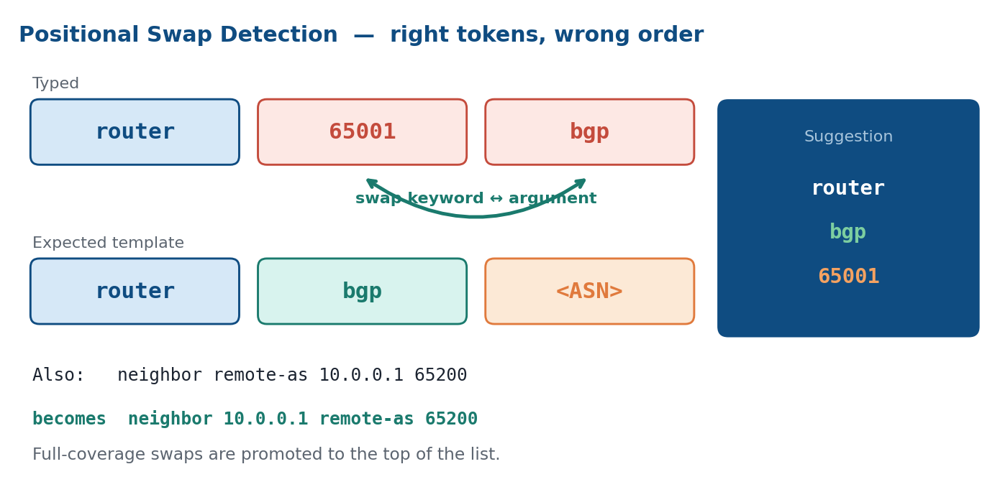

**Example**

```text
NetLab# router 65001 bgp
Closest match:
  router bgp 65001
```

```text
NetLab# neighbor remote-as 10.0.0.1 65200
Closest match:
  neighbor 10.0.0.1 remote-as 65200
```

**Pros**

- Catches a class of error that character-level scoring cannot see: the words are right, the order is wrong.
- A full-coverage reorder is a high-confidence suggestion.
- Can follow fuzzy matching, so a line may have both a typo and a swap.

**Cons**

- Trying every permutation is factorial in the token count. CLI commands are short (typically six tokens or fewer), and type checks prune most of the search.
- Cannot always tell a genuine swap from a different command that uses the same words. Tree scoping reduces that risk but does not remove it.

---

## Technique 15: AI Intent Matching

Local methods work on characters, order, and tree position. They cannot map a valid command from another vendor onto this CLI. An optional AI backend covers that gap: if the user types Cisco or Juniper syntax on a SONiC switch, the text may share no keywords with the local commands. A language model can still recover the intent and map it to this CLI’s catalog.

**How it works**

1. Run techniques 1–14 locally. If they already have a strong match, skip the network call.
2. Otherwise send the failed line and the command catalog to a model (on a server, not on the switch).
3. The model returns up to three suggestions.
4. Enforce a time budget (for example 500 ms). On timeout or outage, keep the local results.

**Example**

A Cisco operator types:

```text
NetLab# show ip bgp neighbors 10.0.0.1 received-routes
```

That is valid IOS, not valid SONiC. Local scoring finds no close keyword match. The backend maps the intent (“BGP routes received from this neighbor”) to:

```text
Closest match:
  show bgp neighbors 10.0.0.1 received-routes
```

A Juniper line such as `show route receive-protocol bgp 10.0.0.1` can map to the same SONiC command.

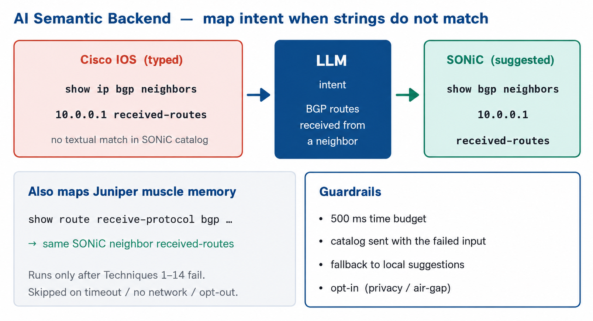

**Pros**

- Handles intent, synonyms, and cross-vendor syntax that no string metric can.
- Failure is safe: if the server is down or slow, the user still gets local suggestions.
- Mappings can improve without changing CLI code.

**Cons**

- Needs reachability to an inference server. Air-gapped networks cannot use it.
- Adds noticeable latency next to sub-millisecond local scoring.
- Not fully deterministic; operators who expect identical output every time may find that surprising.
- Must be opt-in. Command text leaving the device has security and privacy implications.

---

## Technique 16: Combined Approach

No single technique covers every kind of mistake. Technique 16 is one engine with four stages. It does not run Techniques 1–15 in order. It assigns each job to one method, then runs the cheap, high-confidence stages first.

The rest of this section is an overview of the stages, then a closer look at each one.

### The four stages

| Stage   | What it does | Always? |
|---------|----------------|---------|
| Stage 1 | Walk the command tree and score the failing keyword | Yes |
| Stage 2 | Search every complete command, including abbreviations | Only if Stage 1 has no **strong match** |
| Stage 3 | Reorder tokens that are spelled right but in the wrong place | Yes |
| Stage 4 | Optional AI for intent and other-vendor syntax | Only if AI is on and there is still no strong match |

A **strong match** is a very close score (cost ≤ 1). Stage 1 defines those costs. After the last stage, results are deduplicated, sorted by cost (lowest first), and truncated. IPs, ASNs, and names are never rewritten (Technique 13’s rule, inlined in Stages 1–3).

```text
User input
    │
    ▼
┌─ Stage 1 ──────────────────────────┐
│ Tree walk (Technique 10)           │
│ Scorer: weighted Damerau-          │
│ Levenshtein (Techniques 4 and 5)   │
└───────┬───────────────────┬────────┘
        │                   │
        │ no strong match   │ strong match
        ▼                   │
┌─ Stage 2 ──────────────┐  │
│ Flat-corpus scan (11)  │  │
│ Prefix match (1 & 2)   │  │
│ Same scorer as Stage 1 │  │
└───────────┬────────────┘  │
            │               │
            └───────┬───────┘
                    │  always
                    ▼
┌─ Stage 3 ──────────────────────────┐
│ Positional swap (Technique 14)     │
└──────────────┬─────────────────────┘
               │  AI on, still no
               │  strong match
               ▼
┌─ Stage 4 ──────────────────────────┐
│ AI intent matching (Technique 15)  │
│ Optional                           │
└──────────────┬─────────────────────┘
               │
               ▼
         Deduplicate, sort, present
```

### Stage 1 — tree walk and scorer

Walk the command tree token by token (Technique 10).

- An exact keyword moves to the next level.
- A variable slot (`<IP>`, `<ASN>`) keeps the typed value.
- A hyphenated candidate like `running-config` is split into segments and matched against consecutive user tokens (Technique 12). `rning config` matches `running-config` because each segment is scored independently.
- At a keyword that does not match exactly, score only the siblings at that level. Keep costs ≤ 3. After correcting a token, the walk continues into the matched subtree and scores the next token the same way. Costs accumulate across all corrections.

**Scorer.** “How close is this typo to this keyword?” is **Damerau-Levenshtein (Technique 4)** with **Technique 5’s weights**. Stage 2 uses this same function; it does not use a second scorer.

| Edit          | Cost | Example |
|---------------|------|---------|
| Transposition | 0    | `shwo` → `show` |
| Insertion     | 1    | `interfce` → `interface` |
| Substitution  | 2    | `intarface` → `interface` |
| Deletion      | 3    | `showw` → `show` |

A sibling is **accepted** if its cost is ≤ 3. It is a **strong match** if the **total** cost across all corrected tokens is ≤ 1 (for example, one transposition, or one insertion). A strong match skips Stage 2 and Stage 4.

Stage 1 does not expand prefixes (`sh` is not treated as `show` unless the weighted cost happens to pass). It does correct multiple tokens in the same command: `show bpg sumary` corrects `bpg` → `bgp` (transposition, cost 0) and then continues into the `bgp` subtree where `sumary` → `summary` (insertion, cost 1). The total cost is 0 + 1 = 1, which is a strong match.

### Stage 2 — flat-corpus scan

Compare the full line to every complete command (Technique 11). Each user token is matched to the corresponding command token: exact or prefix first (Techniques 1 and 2), then the same weighted scorer. Stage 2’s per-token cutoff is 3 if the command token is ≤ 4 characters, else 4. That is **not** Technique 7’s 2 / 4 / 6 table; it only exists so a short word can still take one deletion (cost 3).

This stage catches what Stage 1 cannot: abbreviations (`sh ip int`) and a lone first keyword (`debug`). It compares tokens by position, so it does not skip a missing middle keyword.

### Stage 3 — positional swap

Always runs (Technique 14). The words may already be spelled correctly but sit in the wrong order: `router 65001 bgp` → `router bgp 65001`. A reorder that uses every token and fills every slot is stored as cost 0 and listed first.

### Stage 4 — AI intent matching

Off by default (Technique 15). When enabled, it runs only if still no candidate has cost ≤ 1. Local stages have already finished, so a missing or empty AI result does not erase them. This is the path for other-vendor syntax (Cisco, Juniper) that shares little text with the local command.

### Techniques in this pipeline

| Technique                            | Stage       | Role |
|--------------------------------------|-------------|------|
| 1 Exact prefix, 2 Multi-token prefix | 2           | Expand abbreviated tokens |
| 4 Damerau-Levenshtein                | 1 and 2     | Edit operations |
| 5 Weighted edit costs                | 1 and 2     | Costs for those operations |
| 10 Tree walk                         | 1           | Which keywords to score |
| 11 Flat-corpus scan                  | 2           | Search the full command list |
| 12 Hyphenated keywords               | 1 and 2     | Split hyphenated candidates and match user tokens segment by segment |
| 13 Argument preservation             | 1, 2, and 3 | Keep IPs, ASNs, and names (inlined) |
| 14 Positional swap                   | 3           | Reorder tokens |
| 15 AI intent matching                | 4           | Optional intent / cross-vendor mapping |

| Technique                | Why it is not a stage  |
|--------------------------|------------------------|
| 3 Levenshtein            | Technique 4 replaces it (adds transpositions). |
| 6 Keyboard-aware         | Alternative substitution cost, not a later stage. This copy is Levenshtein, so it would drop first-class transpositions. |
| 7 Threshold scaling      | Its 2 / 4 / 6 cutoffs assume unit-cost edits. Deletion costs 3 here, so a short-word cutoff of 2 would reject an extra letter. Stage 1 keeps a fixed 3. |
| 8 Jaro-Winkler, 9 N-gram | Other scorers for the same slot as 4 and 5. |

### Examples

| User input                  | Caught by    | Why                                               |
|-----------------------------|--------------|---------------------------------------------------|
| `show interfce`             | Stage 1      | Insertion of missing `a` (cost 1, strong match). Stage 2 is skipped. |
| `show intarface`            | Stage 1      | Substitution of `e` with `a` (cost 2). Not a strong match, so Stage 2 also runs. |
| `show vversion`             | Stage 1      | Deletion of extra `v` (cost 3). Not a strong match, so Stage 2 also runs. |
| `shwo version`              | Stage 1      | Transposition of `w` and `o` (cost 0, strong match). Stage 2 is skipped. |
| `show bpg sumary`           | Stage 1      | `bpg` → transposition (cost 0), then `sumary` → insertion (cost 1). Total cost 0 + 1 = 1 is a strong match. |
| `show rning config`         | Stage 1      | `running-config` is split into `running` + `config`; `rning` matches `running` (two insertions, cost 2). Not a strong match, so Stage 2 also runs. |
| `sh ip int`                 | Stage 2      | Stage 1 accepts `sh` → `show` (cost 2), but `int` → `interface` costs 6 (exceeds threshold). Stage 2 uses prefix expansion instead. |
| `debug`                     | Stage 2      | Stage 1 matches `debug` exactly and has no failing token. |
| `router 65001 bgp`          | Stage 3      | Tokens are spelled correctly; they are in the wrong order. |
| Cisco / Juniper syntax      | Stage 4      | Local stages find no strong string match. |
| IP / ASN / name in the line | Stages 1–3   | Placeholder slots keep the typed value. |

---

## Comparison

| Technique             | Prefix       | Typos  | Transpositions   | Reordering | Hyphens | Uses tree | Complexity |
|-----------------------|:------------:|:------:|:----------------:|:----------:|:-------:|:---------:|------------|
| Exact Prefix          | Yes          | No     | No               | No | No | No | Trivial |
| Multi-token Prefix    | Yes          | No     | No               | No | No | Yes | Tokens × candidates |
| Levenshtein           | No           | Yes    | Partial (cost 2) | No | No | No | Per pair, by string lengths |
| Damerau-Levenshtein   | No           | Yes    | Yes (cost 1)     | No | No | No | Same as Levenshtein |
| Weighted Edit Costs   | No           | Yes    | Yes (cost 0)     | No | No | No | Same as Levenshtein |
| Keyboard-Aware        | No           | Yes    | Partial (cost 2) | No | No | No | Same, plus key lookup |
| Threshold Scaling     | —            | Filter | Filter           | No | No | No | Constant per candidate |
| Jaro-Winkler          | Prefix bonus | Yes    | Partial          | No | No | No | Per pair, by string lengths |
| N-gram Similarity     | Partial      | Yes    | Partial          | No | No | No | Linear in the two lengths |
| Tree Matching         | —            | —      | —                | No | No | Yes | Cost of the inner scorer |
| Flat-Corpus Scan      | Yes          | Yes    | Yes              | No | No | No | Commands × tokens |
| Hyphenated Handling   | No           | Yes    | Yes              | No | Yes | No | Segments × tokens |
| Argument Preservation | —            | —      | —                | — | — | Yes | Linear in tokens |
| Positional Swap       | No           | No     | No               | Yes | No | Yes | Token permutations, pruned |
| AI Intent Matching    | No           | Yes    | Yes              | Yes | Yes | No | Network round trip |
| Combined Approach     | Yes          | Yes    | Yes              | Yes | Yes | Yes | Sum of the stages that run |
